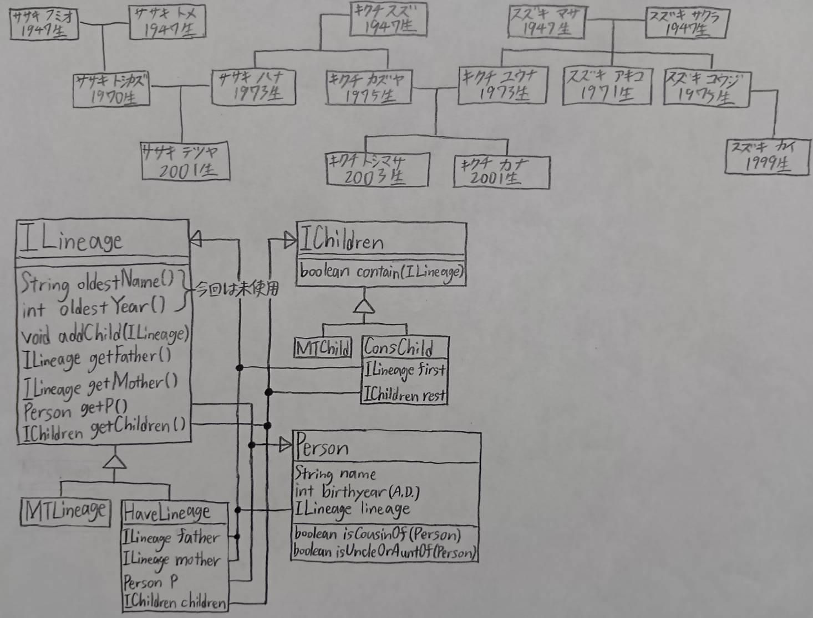

# r6p1

## クラス図

- ファイル名は `class-diagram.jpg` にしてください
- 次のように README.md で表示できるようにしてください
  - `` と書くと、下の画像のように表示されます
  - 提出時は下の画像を消してください

## 情報の例

上の画像に含めた(子から見て左が父親,右が母親)

## 計算の例

補助メソッドに関しては
  - キクチカズヤはササキテツヤのおじかおば(おじ)である
  - ササキテツヤはキクチカズヤのおじかおばではない
  - キクチユウナはササキテツヤのおじかおばではない
  - スズキマサはキクチユウナのおじかおばではない

メインメソッドに関しては
  - ササキテツヤとキクチトシマサはいとこ関係である
  - ササキテツヤとササキテツヤはいとこ関係ではない
  - キクチトシマサとキクチカナはいとこ関係ではない
  - キクチトシマサとスズキカイはいとこ関係である
  - ササキテツヤとスズキカイはいとこ関係ではない
  - ササキハナとキクチユウナはいとこ関係ではない
  - ササキフミオとキクチスズはいとこ関係ではない
